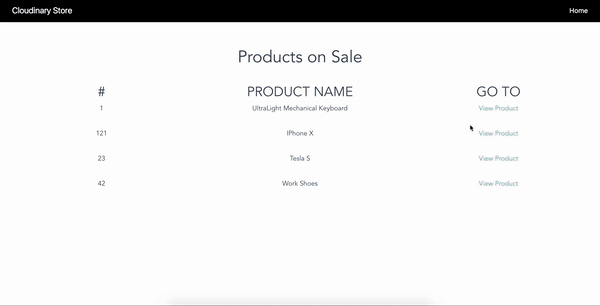

# Building an Amazon-like Preview App



* Clone Repository and install backend dependencies

```bash
cd amazon-like-preview-app
npm install
```

* Set up environment variables and edit variables

```bash
cp .env.example .env
vim .env
```

* Start the backend server by running :

```bash
node server
```

* Install frontend dependencies

```bash
cd frontend
npm install
```

* Start frontend server

```bash
npm run dev
```

View application at work at `localhost:8000`
